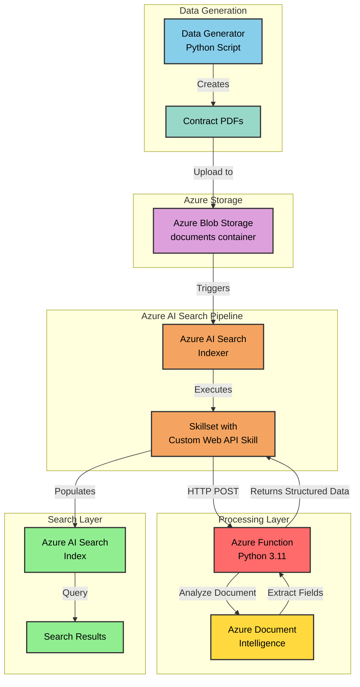

# Contract Indexing with Azure AI Search

A comprehensive solution for automated contract processing and indexing using Azure AI Document Intelligence, Azure Functions, and Azure AI Search. This project demonstrates an intelligent document processing pipeline that extracts structured data from contract PDFs and makes them searchable through Azure AI Search.

## 🏗️ Architecture



## 📋 Overview

This solution provides an end-to-end pipeline for:

1. **Contract Generation**: Creates realistic contract PDFs with various types (hosting, cloud services, software licensing, etc.)
2. **Automated Processing**: Uses Azure AI Document Intelligence's prebuilt contract model to extract key information
3. **Intelligent Indexing**: Leverages Azure AI Search with custom skills for enrichment
4. **Searchable Repository**: Makes contracts searchable by parties, dates, jurisdictions, and other fields

### Key Features

- **Multi-type Contract Support**: Handles various contract types (hosting agreements, cloud services, software licenses, maintenance agreements, data processing agreements)
- **Rich Field Extraction**: Extracts parties, dates (execution, effective, expiration, renewal), contract IDs, jurisdictions, and more
- **Scalable Architecture**: Built on Azure Flex Consumption plan for automatic scaling
- **Infrastructure as Code**: Complete Bicep templates for reproducible deployments

## 🗂️ Project Structure

```
contractIndexing/
├── infra/                          # Infrastructure as Code
│   ├── main.bicep                  # Main infrastructure template
│   ├── main.bicepparam             # Parameters file
│   └── modules/
│       ├── docIntelligence.bicep   # Document Intelligence resource
│       ├── functions.bicep         # Function App configuration
│       └── rbac.functions.bicep    # Role assignments
├── src/
│   ├── dataGenerator/              # Contract PDF generator
│   │   ├── main.py                 # Generates sample contracts
│   │   └── pyproject.toml
│   └── functions/                  # Azure Functions
│       ├── function_app.py         # Main function handler
│       ├── requirements.txt
│       ├── models/                 # Pydantic models
│       │   └── contract.py
│       ├── request/                # Request/Response models
│       │   ├── document_request.py
│       │   └── document_output.py
│       └── services/               # Business logic
│           └── contract_service.py
├── aiSearchConfig/                 # Azure AI Search configuration
│   ├── datasource.json            # Blob storage data source
│   ├── index.json                 # Search index schema
│   ├── indexer.json               # Indexer configuration
│   └── skillset.json              # Custom skill definition
└── .github/
    └── workflows/
        └── infrastructure.yml     # GitHub Actions workflow
```

## 🔑 Key Components

### 1. Azure Document Intelligence
- Uses the **prebuilt-contract** model
- Extracts structured fields from contract PDFs
- Handles party information, dates, jurisdictions, and contract metadata

### 2. Azure Function (Custom Skill)
- Acts as a custom Web API skill for Azure AI Search
- Processes documents from blob storage
- Returns structured JSON matching the search index schema

### 3. Azure AI Search
- **Data Source**: Azure Blob Storage (documents container)
- **Skillset**: Custom Web API skill calling Azure Function
- **Index**: Structured schema for contract fields
- **Indexer**: Scheduled hourly, processes new documents automatically

### 4. Data Generator
- Creates realistic contract PDFs with:
  - Multiple parties (Contoso, Fabrikam, Northwind, etc.)
  - Various contract types
  - Random dates and durations
  - Jurisdiction clauses
  - Formatted layouts with colors and styling

## 🚀 Prerequisites

- **Azure Subscription**: Active Azure subscription with Owner or Contributor access
- **GitHub Account**: For running GitHub Actions workflows
- **Python 3.11+**: For running the data generator and functions
- **Azure Functions Core Tools**: For local function development ([Install Functions Core Tools](https://docs.microsoft.com/azure/azure-functions/functions-run-local))
- **Azure CLI** (optional): For manual deployment or local testing ([Install Azure CLI](https://docs.microsoft.com/cli/azure/install-azure-cli))

## 📦 Installation & Setup

### Step 1: Clone the Repository

```bash
git clone https://github.com/hugogirard/contractIndexing.git
cd contractIndexing
```

### Step 2: Configure GitHub Secrets

Before deploying infrastructure, you need to set up GitHub secrets for authentication.

Go to your GitHub repository → **Settings** → **Secrets and variables** → **Actions** → **New repository secret**

Create the following secrets:

1. **AZURE_CREDENTIALS**: Azure service principal credentials with **Owner** role (JSON format with clientId, clientSecret, subscriptionId, tenantId)
2. **AZURE_SUBSCRIPTION**: Your Azure subscription ID (GUID format)

> **Note**: The service principal requires **Owner** role to properly assign RBAC permissions for managed identities during deployment.

### Step 3: Deploy Azure Infrastructure via GitHub Actions

The infrastructure deployment is automated using GitHub Actions workflow.

#### Option A: Automatic Deployment (Recommended)

The workflow automatically runs when you push changes to Bicep files:

```bash
# Make a change to any Bicep file or simply trigger a re-run
git add infra/
git commit -m "Deploy infrastructure"
git push
```

#### Option B: Manual Deployment

1. Go to your GitHub repository
2. Navigate to **Actions** tab
3. Select **"Create Azure Resources"** workflow
4. Click **"Run workflow"** button
5. Select the branch (usually `main`)
6. Click **"Run workflow"**

The workflow will:
- ✅ Deploy Resource Group
- ✅ Deploy Azure Storage Account (for documents and function storage)
- ✅ Deploy Azure Document Intelligence (Form Recognizer)
- ✅ Deploy Azure Function App (Flex Consumption plan)
- ✅ Deploy Application Insights
- ✅ Deploy Log Analytics Workspace

**Note**: The deployment takes approximately 5-10 minutes. You can monitor progress in the Actions tab.

#### Verify Deployment

After successful deployment, verify resources were created:
1. Go to [Azure Portal](https://portal.azure.com)
2. Navigate to resource group `rg-contract-analyzer-tmplt`
3. Verify the following resources exist:
   - Storage Account (str{suffix})
   - Document Intelligence (doc-{suffix})
   - Function App (funcskill-{suffix})
   - Application Insights
   - Log Analytics Workspace

### Step 4: Generate Sample Contracts

```bash
cd ../dataGenerator

# Install dependencies
pip install -e .

# Generate contracts (default: 20 contracts)
python main.py

# Or specify number of contracts
python main.py --count 50
```

This creates PDFs in `generated_contracts/` directory.

### Step 5: Upload Contracts to Azure Blob Storage

1. Go to [Azure Portal](https://portal.azure.com)
2. Navigate to your resource group `rg-contract-analyzer-tmplt`
3. Open the Storage Account (str{suffix})
4. Go to **Containers** → **documents**
5. Click **Upload** and select all PDF files from the `generated_contracts/` folder
6. Wait for the upload to complete

### Step 6: Configure Azure AI Search

#### Create Azure AI Search Service

1. In Azure Portal, create a new **Azure AI Search** service
2. Choose the same resource group: `rg-contract-analyzer-tmplt`
3. Select pricing tier (Basic or Standard recommended)
4. Wait for deployment to complete

#### Update Configuration Files

Before creating search resources, update the following configuration files:

**1. Update `aiSearchConfig/datasource.json`:**
   - Replace the `connectionString` value with your storage account resource ID:
     ```json
     "connectionString": "ResourceId=/subscriptions/{YOUR-SUBSCRIPTION-ID}/resourceGroups/rg-contract-analyzer-tmplt/providers/Microsoft.Storage/storageAccounts/{YOUR-STORAGE-ACCOUNT-NAME};"
     ```

**2. Update `aiSearchConfig/skillset.json`:**
   - Replace `__functionUrl__` with your Azure Function URL:
     ```json
     "uri": "https://funcskill-{suffix}.azurewebsites.net/api/process?code={function-key}"
     ```
   - To get the Function URL:
     - Go to Function App in Azure Portal
     - Navigate to **Functions** → **process** → **Get Function URL**

#### Create Search Resources in Azure Portal

1. **Create Data Source:**
   - Go to your Azure AI Search service
   - Navigate to **Data sources** → **Add data source**
   - Name: `dtidx`
   - Data source type: **Azure Blob Storage**
   - Connection string: Use managed identity or your storage account
   - Container: `documents`

2. **Create Index:**
   - Navigate to **Indexes** → **Add index**
   - Use the schema from `aiSearchConfig/index.json`
   - Index name: `contract`

3. **Create Skillset:**
   - Navigate to **Skillsets** → **Add skillset**
   - Name: `contractskillset`
   - Use configuration from `aiSearchConfig/skillset.json`

4. **Create Indexer:**
   - Navigate to **Indexers** → **Add indexer**
   - Name: `indexercontract`
   - Data source: `dtidx`
   - Skillset: `contractskillset`
   - Target index: `contract`
   - Schedule: Run hourly (PT1H)
   - Use field mappings from `aiSearchConfig/indexer.json`

## 📊 Extracted Contract Fields

The solution extracts and indexes the following fields:

| Field | Type | Description |
|-------|------|-------------|
| **docType** | String | Document type from Document Intelligence |
| **title** | String | Contract title (e.g., "WEB HOSTING AGREEMENT") |
| **contractId** | String | Unique contract identifier |
| **parties** | Array | Contract parties with name, address, reference name |
| **executionDate** | String | Date contract was signed |
| **effectiveDate** | String | Date contract becomes effective |
| **expirationDate** | String | Contract end date |
| **contractDuration** | String | Duration in months |
| **renewalDate** | String | Date for renewal consideration |
| **jurisdictions** | Array | Governing law jurisdictions and clauses |

## 🤝 Contributing

Contributions are welcome! Please feel free to submit a Pull Request.

## 📄 License

This project is licensed under the terms specified in the LICENSE file.

## 🙏 Acknowledgments

- Built with Azure AI Document Intelligence
- Uses Azure Verified Modules (AVM) for infrastructure
- Leverages Azure AI Search custom skills pattern

## 📚 Additional Resources

- [Azure AI Document Intelligence](https://learn.microsoft.com/azure/ai-services/document-intelligence/)
- [Azure AI Search Custom Skills](https://learn.microsoft.com/azure/search/cognitive-search-custom-skill-web-api)
- [Azure Functions Python Developer Guide](https://learn.microsoft.com/azure/azure-functions/functions-reference-python)
- [Bicep Documentation](https://learn.microsoft.com/azure/azure-resource-manager/bicep/)

---

**Author**: Hugo Girard  
**Repository**: [contractIndexing](https://github.com/hugogirard/contractIndexing)
