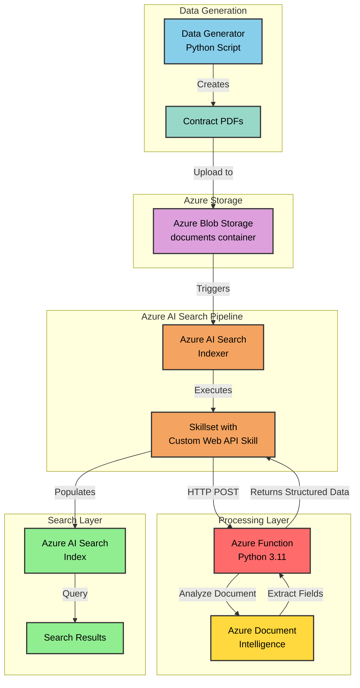

# Contract Indexing with Azure AI Search

A comprehensive solution for automated contract processing and indexing using Azure AI Document Intelligence, Azure Functions, and Azure AI Search. This project demonstrates an intelligent document processing pipeline that extracts structured data from contract PDFs and makes them searchable through Azure AI Search.

## 🏗️ Architecture



## 📋 Overview

This solution provides an end-to-end pipeline for:

1. **Contract Generation**: Creates realistic contract PDFs with various types (hosting, cloud services, software licensing, etc.)
2. **Automated Processing**: Uses Azure AI Document Intelligence's prebuilt contract model to extract key information
3. **Intelligent Indexing**: Leverages Azure AI Search with custom skills for enrichment
4. **Searchable Repository**: Makes contracts searchable by parties, dates, jurisdictions, and other fields

### Key Features

- **Multi-type Contract Support**: Handles various contract types (hosting agreements, cloud services, software licenses, maintenance agreements, data processing agreements)
- **Rich Field Extraction**: Extracts parties, dates (execution, effective, expiration, renewal), contract IDs, jurisdictions, and more
- **Scalable Architecture**: Built on Azure Flex Consumption plan for automatic scaling
- **Infrastructure as Code**: Complete Bicep templates for reproducible deployments

## 🗂️ Project Structure

```
contractIndexing/
├── infra/                          # Infrastructure as Code
│   ├── main.bicep                  # Main infrastructure template
│   ├── main.bicepparam             # Parameters file
│   └── modules/
│       ├── docIntelligence.bicep   # Document Intelligence resource
│       ├── functions.bicep         # Function App configuration
│       └── rbac.functions.bicep    # Role assignments
├── src/
│   ├── dataGenerator/              # Contract PDF generator
│   │   ├── main.py                 # Generates sample contracts
│   │   └── pyproject.toml
│   └── functions/                  # Azure Functions
│       ├── function_app.py         # Main function handler
│       ├── requirements.txt
│       ├── models/                 # Pydantic models
│       │   └── contract.py
│       ├── request/                # Request/Response models
│       │   ├── document_request.py
│       │   └── document_output.py
│       └── services/               # Business logic
│           └── contract_service.py
├── aiSearchConfig/                 # Azure AI Search configuration
│   ├── datasource.json            # Blob storage data source
│   ├── index.json                 # Search index schema
│   ├── indexer.json               # Indexer configuration
│   └── skillset.json              # Custom skill definition
└── .github/
    └── workflows/
        ├── infrastructure.yml     # GitHub Actions - Deploy Azure resources
        └── functions.yml          # GitHub Actions - Deploy Function App
```

## 🔑 Key Components

### 1. Azure Document Intelligence
- Uses the **prebuilt-contract** model
- Extracts structured fields from contract PDFs
- Handles party information, dates, jurisdictions, and contract metadata

### 2. Azure Function (Custom Skill)
- Acts as a custom Web API skill for Azure AI Search
- Processes documents from blob storage
- Returns structured JSON matching the search index schema

### 3. Azure AI Search
- **Data Source**: Azure Blob Storage (documents container)
- **Skillset**: Custom Web API skill calling Azure Function
- **Index**: Structured schema for contract fields
- **Indexer**: Scheduled hourly, processes new documents automatically

### 4. Data Generator
- Creates realistic contract PDFs with:
  - Multiple parties (Contoso, Fabrikam, Northwind, etc.)
  - Various contract types
  - Random dates and durations
  - Jurisdiction clauses
  - Formatted layouts with colors and styling

## 🚀 Prerequisites

- **Azure Subscription**: Active Azure subscription with Owner or Contributor access
- **GitHub Account**: For running GitHub Actions workflows
- **Python 3.11+**: For running the data generator and functions
- **Azure Functions Core Tools**: For local function development ([Install Functions Core Tools](https://docs.microsoft.com/azure/azure-functions/functions-run-local))
- **Azure CLI** (optional): For manual deployment or local testing ([Install Azure CLI](https://docs.microsoft.com/cli/azure/install-azure-cli))

## 📦 Installation & Setup

### Step 1: Clone the Repository

```bash
git clone https://github.com/hugogirard/contractIndexing.git
cd contractIndexing
```

### Step 2: Configure GitHub Secrets

Before deploying infrastructure, you need to set up GitHub secrets for authentication.

#### Create Azure Service Principal

First, create a service principal with Owner role on your subscription:

```bash
# Login to Azure
az login

# Set your subscription (replace with your subscription ID)
az account set --subscription "<your-subscription-id>"

# Create service principal with Owner role
az ad sp create-for-rbac \
  --name "github-actions-contractindexing" \
  --role owner \
  --scopes /subscriptions/<your-subscription-id> \
  --sdk-auth
```

This command will output JSON credentials that look like this:

```json
{
  "clientId": "00000000-0000-0000-0000-000000000000",
  "clientSecret": "your-client-secret-here",
  "subscriptionId": "00000000-0000-0000-0000-000000000000",
  "tenantId": "00000000-0000-0000-0000-000000000000"
}
```

**Important**: Copy this entire JSON output keeping the same structure than above - you'll need it for the GitHub secret.

> **Note**: The service principal requires **Owner** role to properly assign RBAC permissions for managed identities during deployment.

#### Add Secrets to GitHub

Go to your GitHub repository → **Settings** → **Secrets and variables** → **Actions** → **New repository secret**

Create the following secrets:

1. **AZURE_CREDENTIALS**: Paste the entire JSON output from the service principal creation command above
2. **AZURE_SUBSCRIPTION**: Your Azure subscription ID (GUID format, e.g., `00000000-0000-0000-0000-000000000000`)

Example for `AZURE_SUBSCRIPTION`:
```
12345678-1234-1234-1234-123456789012
```

### Step 3: Deploy Azure Infrastructure via GitHub Actions

The infrastructure deployment is fully automated using the GitHub Actions workflow located at `.github/workflows/infrastructure.yml`.

#### What Gets Deployed

The infrastructure deployment creates the following Azure resources:

- **Resource Group**: Container for all resources
- **Azure Storage Account**: Stores contract PDFs in the `documents` container
- **Azure Document Intelligence**: Prebuilt contract model for field extraction
- **Azure Function App**: Flex Consumption plan with Python 3.11 runtime
- **Azure AI Search**: Search service with datasource, index, indexer, and skillset (created manually after infrastructure)
- **Managed Identities**: System-assigned identity for Function App with proper RBAC permissions
- **Application Insights**: Monitoring and logging for the Function App

> **⚠️ Important - Deployment Region**: By default, all Azure resources will be deployed to the **Canada Central** region. If you need to deploy to a different region, please see the [Deployment Configuration](#deployment-configuration) section below **before** running the workflow.

#### Trigger the Deployment

1. Go to your GitHub repository
2. Click on **Actions** tab
3. Select **Create Azure Resources** workflow
4. Click **Run workflow** button
5. Select the branch (usually `main`)
6. Click **Run workflow**

#### Monitor the Deployment

1. In the **Actions** tab, click on the running workflow
2. Click on the **create-azure-resources** job to see detailed logs
3. The deployment typically takes 5-10 minutes
4. Upon successful completion, you'll see:
   - All Azure resources created
   - Output values captured (Function App name)
   - GitHub secret `FUNCTION_APP_NAME` automatically created for the next step

#### Deployment Configuration

The deployment can be customized by editing `infra/main.bicepparam`:

```bicep
using 'main.bicep'

param location = 'canadacentral'  // Change to your preferred region
param rgName = 'rg-contract-analyzer-tmplt' // Change to your preferred name
```

**Important**: The GitHub Actions workflow deploys to `canadacentral` by default.

### Step 4: Deploy Azure Functions via GitHub Actions

After the infrastructure is deployed, you need to deploy the Azure Functions code that acts as the custom Web API skill.

#### What Gets Deployed

The Function App deployment includes:

- **Python Function Code**: HTTP-triggered function (`function_app.py`)
- **Dependencies**: All packages from `requirements.txt`
- **Pydantic Models**: Contract, Party, and Date models for structured data
- **Services**: Contract processing service that calls Document Intelligence
- **Configuration**: Automatically uses managed identity for authentication

#### Trigger the Deployment

1. Ensure the infrastructure deployment completed successfully (Step 3)
2. Go to your GitHub repository → **Actions** tab
3. Select **Deploy Skillsets to Azure Function App** workflow
4. Click **Run workflow** button
5. Select the branch (usually `main`)
6. Click **Run workflow**

The workflow will:
1. Checkout the repository code
2. Set up Python 3.11 environment
3. Install dependencies from `requirements.txt`
4. Package the function code
5. Deploy to the Function App using managed identity authentication
6. Enable Oryx build for optimized deployment

#### Monitor the Deployment

1. Watch the workflow progress in the **Actions** tab
2. The deployment typically takes 3-5 minutes

#### Verify Function Deployment

After deployment, test the function:

1. **Via Azure Portal**:
   - Navigate to your Function App
   - Go to **Functions** → **analyze_contract**
   - Click **Get Function Url** and copy the URL with the code parameter
   - Copy the **default (Function Key)**

### Step 5: Generate and Upload Contracts for Indexing

Now that the infrastructure and functions are deployed, you can generate sample contracts and upload them to be processed by the AI Search pipeline.

#### Understanding the Data Generator

The data generator (`src/dataGenerator/main.py`) creates realistic contract PDFs with:

- **Multiple Contract Types**: Web hosting, cloud services, software licensing, maintenance agreements, data processing agreements
- **Realistic Parties**: Various fictional companies (Contoso, Fabrikam, Northwind, Fourth Coffee, Woodgrove Bank)
- **Random Dates**: Contract execution, effective, expiration, and renewal dates
- **Jurisdictions**: Different US states for governing law
- **Professional Formatting**: Colored headers, styled sections, tables, and signatures

#### Generate Contract PDFs

1. **Navigate to the data generator directory**:
   ```bash
   cd src/dataGenerator
   ```

2. **Install dependencies** (first time only):
   ```bash
   pip install -r requirements.txt
   ```

3. **Run the generator**:
   ```bash
   python main.py
   ```

   This will create 10 sample contract PDFs in the `generated_contracts/` folder with names.  You will need to upload them in the Azure Storage.

#### Upload Contracts to Azure Blob Storage

You have two options to upload the generated contracts:

1. Open [Azure Portal](https://portal.azure.com)
2. Navigate to your Storage Account (e.g., `strl<unique-id>`)
3. Go to **Containers** → **documents**
4. Click **Upload**
5. Select all PDFs from `src/dataGenerator/generated_contracts/`
6. Click **Upload**

### Step 6: Configure Azure AI Search

Now that contracts are uploaded to blob storage, you need to configure Azure AI Search to create the complete indexing pipeline. This involves creating four components in order: Data Source, Index, Skillset, and Indexer.

#### 6.1 Create the Data Source

The data source connects Azure AI Search to your blob storage container.

1. **Get your Storage Account Resource ID**:
   - Go to [Azure Portal](https://portal.azure.com)
   - Navigate to your Storage Account (named `strl<unique-id>`)
   - In the left menu, click **Endpoints**
   - Copy the **Storage account resource ID** (it looks like `/subscriptions/xxx/resourceGroups/xxx/providers/Microsoft.Storage/storageAccounts/strlxxx`)

2. **Update the datasource.json file**:
   - Open `aiSearchConfig/datasource.json` from your local repository
   - Locate the `connectionString` field
   - Replace it with your Storage Account Resource ID in this format:
     ```
     "connectionString": "ResourceId=/subscriptions/xxx/resourceGroups/xxx/providers/Microsoft.Storage/storageAccounts/strlxxx;"
     ```
   - ⚠️ **Important**: Add `ResourceId=` at the beginning and `;` at the end

   **Example of complete datasource.json**:
   ```json
   {
       "name": "dtidx",
       "description": "Blob storage data source for contract documents",
       "type": "azureblob",
       "credentials": {
           "connectionString": "ResourceId=/subscriptions/12345678-1234-1234-1234-123456789012/resourceGroups/rg-contract-analyzer-tmplt/providers/Microsoft.Storage/storageAccounts/strl2d92a;"
       },
       "container": {
           "name": "documents"
       }
   }
   ```

3. **Create the data source in Azure**:
   - In Azure Portal, navigate to your **Azure AI Search** service
   - Click **Data sources** in the left menu
   - Click **+ Add data source**
   - Select **Add data source (JSON)**
   - Paste the entire content of your updated `datasource.json` file
   - Click **Save**

#### 6.2 Create the Index

The index defines the schema for your searchable contract data.

1. **In Azure Portal**, still in your Azure AI Search service:
   - Click **Indexes** in the left menu
   - Click **+ Add index**
   - Select **Add Index (JSON)**

2. **Copy the index definition**:
   - Open `aiSearchConfig/index.json` from your repository
   - Copy the entire JSON content
   - Paste it into the Azure Portal
   - Click **Save**

The index includes fields for contract parties, dates, jurisdictions, and other extracted metadata.

#### 6.3 Create the Skillset

The skillset defines the custom Web API skill that calls your Azure Function to process documents.

1. **Get your Function URL**:
   - If you didn't save it from Step 4, go to your Function App in Azure Portal
   - Navigate to **Functions** → **analyze_contract**
   - Click **Get Function Url**
   - Copy the complete URL (including the `code` parameter)
   - Example: `https://func-xxx.azurewebsites.net/api/analyze_contract?code=xxx`

2. **Update the skillset.json file**:
   - Open `aiSearchConfig/skillset.json` from your repository
   - Find the line: `"uri": "__functionUrl__"`
   - Replace `__functionUrl__` with your actual Function URL (keep the quotes)
   
   **Example**:
   ```json
   "uri": "https://func-xxx.azurewebsites.net/api/analyze_contract?code=xxx"
   ```

3. **Create the skillset in Azure**:
   - In Azure Portal, in your Azure AI Search service
   - Click **Skillsets** in the left menu
   - Click **+ Add skillset**
   - Select **Add skillset (JSON)**
   - Copy the entire content of your updated `skillset.json` file
   - Paste it into the Azure Portal
   - Click **Save**

#### 6.4 Create the Indexer

The indexer orchestrates the entire pipeline, pulling documents from the data source, running them through the skillset, and populating the index.

1. **In Azure Portal**, in your Azure AI Search service:
   - Click **Indexers** in the left menu
   - Click **+ Add indexer**
   - Select **Add indexer (JSON)**

2. **Copy the indexer definition**:
   - Open `aiSearchConfig/indexer.json` from your repository
   - Copy the entire JSON content
   - Paste it into the Azure Portal
   - Click **Save**

#### 6.5 Monitor Indexing Progress

Once the indexer is created, it will automatically start processing your documents.

1. **Watch the indexer run**:
   - In Azure Portal, stay on the **Indexers** page
   - Click the **Refresh** button periodically
   - You should see the indexer status change to **In progress**

2. **Check completion**:
   - After a few minutes, the status should change to **Success**
   - You should see **10/10** documents successfully indexed (or however many contracts you uploaded)
   - Click on the indexer name to view detailed execution history

3. **Troubleshooting**:
   - If the indexer shows errors, click on the indexer to view the execution details
   - Common issues:
     - **Function URL incorrect**: Verify the skillset has the correct function URL with code parameter
     - **Permissions**: Ensure the Function App managed identity has permissions to access Document Intelligence
     - **Storage connection**: Verify the data source connection string is correct

### Step 7: Query Your Indexed Contracts

Congratulations! Your contract indexing pipeline is now fully operational. You can now search and query your contracts.

#### Query via Azure Portal

1. **Navigate to your Azure AI Search service**
2. Click **Indexes** in the left menu
3. Click on your index name
4. Click **Search explorer** at the top
5. Try some queries:

**Example queries**:

- **Search all contracts**:
  ```
  search=*
  ```

- **Search by company name**:
  ```
  search=Contoso
  ```

- **Search by contract type**:
  ```
  search=hosting
  ```

- **Filter by execution date**:
  ```
  search=*&$filter=executionDate ge 2024-01-01
  ```

- **Search with specific fields**:
  ```
  search=*&$select=contractId,parties,executionDate,contractType
  ```
